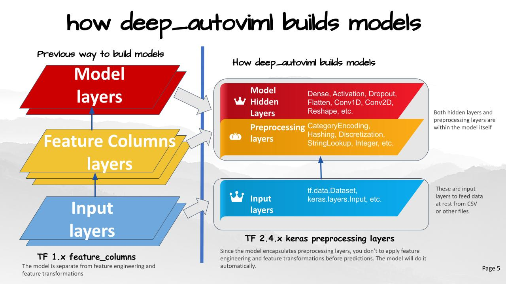

# deep_autoviml
## Build keras pipelines and models in a single line of code!

[](https://www.python.org/)
[](https://github.com/AutoViML)
[](https://github.com/RichardLitt/standard-readme)
[](https://pypi.org/project/autoviml)
[](https://github.com/AutoViML)
## Table of Contents
<ul>
<li><a href="#Motivation">Motivation</a></li>
<li><a href="#InnerWorking">How it works</a></li>
<li><a href="#technology">Technology</a></li>
<li><a href="#install">Install</a></li>
<li><a href="#usage">Usage</a></li>
<li><a href="#api">API</a></li>
<li><a href="#image">Image Classification</a></li>
<li><a href="#nlp">NLP Tasks</a></li>
<li><a href="#tips">Tips for using deep_autoviml</a></li>
<li><a href="#maintainers">Maintainers</a></li>
<li><a href="#contributing">Contributing</a></li>
<li><a href="#license">License</a></li>
</ul>

## Motivation
✨ deep_autoviml is a powerful new deep learning library with a very simple design goal:  ✨
>           Make it as easy as possible for novices and 
>           experts alike to experiment with and build tensorflow.keras
>           preprocessing pipelines and models in as few lines of code
>           as possible.

### Watch YouTube Video for Demo of Deep_AutoViML
[](https://www.youtube.com/watch?v=IcpwNNNXsWE)

deep_autoviml is a tensorflow >2.4-enabled, keras-ready, model and pipeline building utility.
deep autoviml is meant for data engineers, data scientists and ml engineers to quickly prototype and build tensorflow 2.4.1+ models and pipelines for any data set, any size using a single line of code. It can build models for structured data, NLP and image datasets. It can also handle time series data sets. You can either choose deep_autoviml to automatically buid a custom Tensorflow model or you can "bring your own model" ("BYOM" option) model to attach keras data pipelines to your model. Additionally, you can choose any Tensorflow Hub model (TFHub) to train on your data. Just see the instructions below in <a href="#tips">"Tips for using deep_autoviml"</a></li> section.


## InnerWorking
These are the main features that distinguish deep_autoviml from other libraries:
- It uses keras preprocessing layers which are more intuitive, and are included inside your model to simplify deployment
- The pipeline is available to you to use as inputs in your own functional model (if you so wish - you must specify that option in the input - see below for "pipeline")
- It can import any csv, txt or gzip file or file patterns (that fit multiple files) and it can scale to any data set of any size due to tf.data.Dataset's superior data pipelining features (such as cache, prefetch, batch, etc.)
- It uses an amazing new tuner called [STORM tuner](https://github.com/ben-arnao/StoRM) that quickly searches for the best hyperparameters for your keras model in fewer than 25 trials
- If you want to fine tune your model even further, you can fiddle with a wide variety of model options or keras options using **kwargs like dictionaries
- You can import your own custom Sequential model and watch it transform it into a functional model with additional preprocessing and output layers and train the model with your data 
- You can save the model on your local machine or copy it to any cloud provider's storage bucket and serve it from there using tensorflow Serving (TF.Serving)
- Since your model contains preprocessing layers built-in, you just need to provide your Tensorflow serving model with raw data to test and get back predictions in the same format as your training labels.


## Technology

deep_autoviml uses the latest in tensorflow (2.4.1+) td.data.Datasets and tf.keras preprocessing technologies: the Keras preprocessing layers enable you to encapsulate feature engineering and preprocessing into the model itself. This makes the process for training and predictions the same: just feed input data (in the form of files or dataframes) and the model will take care of all preprocessing before predictions. 

To perform its preprocessing on the model itself, deep_autoviml uses [tensorflow](https://www.tensorflow.org/) (TF 2.4.1+ and later versions) and [tf.keras](https://www.tensorflow.org/api_docs/python/tf/keras) experimental preprocessing layers: these layers are part of your saved model. They become part of the model's computational graph that can be optimized and executed on any device including GPU's and TPU's. By packaging everything as a single unit, we save the effort in reimplementing the preprocessing logic on the production server. The new model can take raw tabular data with numeric and categorical variables or strings text directly without any preprocessing. This avoids missing or incorrect configuration for the preprocesing_layer during production.

In addition, to select the best hyper parameters for the model, it uses a new open source library:
- [storm-tuner](https://github.com/ben-arnao/StoRM) - storm-tuner is an amazing new library that enables us to quickly fine tune our keras sequential models with hyperparameters and find a performant model within a few trials.


## Install

deep_autoviml requires [tensorflow](https://www.tensorflow.org/api_docs/python/tf) v2.4.1+ and [storm-tuner](https://github.com/ben-arnao/StoRM)  to run. Don't worry! We will install these libraries when you install deep_autoviml.

```
pip install deep_autoviml
```

For your own conda environment...

```
conda create -n <your_env_name> python=3.7 anaconda
conda activate <your_env_name> # ON WINDOWS: `source activate <your_env_name>`
pip install deep_autoviml
or
pip install git+https://github.com/AutoViML/deep_autoviml.git
```

## Usage


deep_autoviml can be invoked with a simple import and run statement:

```
from deep_autoviml import deep_autoviml as deepauto
```

Load a data set (any .csv or .gzip or .gz or .txt file) into deep_autoviml and it will split it into Train and Validation  datasets inside. You only need to provide a target variable, a project_name to store files in your local machine and leave the rest to defaults:

```
model, cat_vocab_dict = deepauto.fit(train, target, keras_model_type="auto",
            project_name="deep_autoviml", keras_options={}, model_options={}, 
            save_model_flag=True, use_my_model='', model_use_case='', verbose=0)
```

Once deep_autoviml writes your saved model and cat_vocab_dict files to disk in the project_name directory, you can load it from anywhere (including cloud) for predictions like this using the model and cat_vocab_dict generated above:

There are two kinds of predictions: This is the usual (typical) format.
```
predictions = deepauto.predict(model, project_name, test_dataset=test,
            keras_model_type=keras_model_type, cat_vocab_dict=cat_vocab_dict)
```

In case you are performing image classification, then you need to use `deepauto.predict_images()` for making predictions. See the Image section below for more details.

## API
**Arguments**

deep_autoviml requires only a single line of code to get started. You can however, fine tune the model we build using multiple options using dictionaries named "model_options" and "keras_options". These two dictionaries act like python **kwargs to enable you to fine tune hyperparameters for building our tf.keras model. Instructions on how to use them are provided below.


- `train`: could be a datapath+filename or a pandas dataframe. Deep Auto_ViML even handles gz or gzip files. You must specify the full path and file name for it find and load it.
- `target`: name of the target variable in the data set.
- `keras_model_type`: default is "auto" ## But always try "fast", then "fast1", and "fast2", finally "auto". If you want to run NLP, use "BERT" and if you want to do image classification, set it to "image". In most structured data sets, keras_model_type is a quick way for you to select some fantastic model architectures that have been successful in the past. For example:
<b>fast</b>: a quick model that applies deep layers for all variables. 
<b>fast1</b>: a deep and wide model that sends the same variables to both a deep and wide layer simultaneously. 
<b>fast2</b>: a deep and cross model that crosses some variables to build a deep and cross layer simultaneously. 
<b>auto</b>: This will build multiple dense layers in sequence that will then use Storm-Tuner to fine tune the hyper parameters for your model. 
- `project_name`: must be a string. Name of the folder where we will save your keras saved model and logs for tensorboard
- `model_options`: must be a dictionary. For example: {'max_trials':5} sets the number of trials to run Storm-Tuner to search for the best hyper parameters for your keras model.
- `keras_options`: must be a dictionary. You can use it for changing any keras model option you want such as "epochs", "kernel_initializer", "activation", "loss", "metrics", etc.
- `model_use_case`: must be a string. You can use it for telling deep_autoviml what kind of use case you will use such as "time series", "seq2seq", modeling etc. This option is currently not used but you should watch this space for more model announcements.
- `save_model_flag`: must be True or False. The model will be saved in keras model format.
- `use_my_model`: This is where "bring your own model" (BYOM) option comes into play. This BYOM model must be a keras Sequential model with NO input layers and output layers! You can define it and send it as input here. We will add input and preprocessing layers to it automatically. Your custom defined model must contain only hidden layers (Dense, Conv1D, Conv2D, etc.), and dropouts, activations, etc. The default for this argument is "" (empty string) which means we will build your model. If you provide your custom model object here, we will use it instead.
- `verbose`: must be 0, 1 or 2. Can also be True or False. You can see more and more outputs as you increase the verbose level. If you want to see a chart of your model, use verbose = 2. But you must have graphviz and pydot installed in your machine to see the model plot.

## Image

Leaf Images referred to here are from Kaggle and are copyright of Kaggle. They are shown for illustrative purposes.
[Kaggle Leaf Image Classification](https://www.kaggle.com/c/leaf-classification)

deep_autoviml can do image classification. All you need to do is to organize your image_dir folder under train, validation and test sub folders. Train folder for example, can contain images for each label as a sub-folder. All you need to provide is the name of the image directory for example "leaf_classification" and deep_autoviml will automatically read the images and assign them correct labels and the correct dataset (train, test, etc.)

`image_dir` = `"leaf_classification"`
You also need to provide the height and width of each image as well as the number of channels for each image.
```
img_height = 224
img_width = 224
img_channels = 3
```
You then need to set the keras model type argument as "image". 

`keras_model_type` =  `"image"` 

You also need to send in the above arguments as model options as follows:
`model_options = {'image_directory': image_dir, 'image_height': img_height, 'image_width':img_width, 'image_channels':img_channels }`

You can then call deep_autoviml for training the model as usual with these inputs:
```model, dicti = deepauto.fit(trainfile, target, keras_model_type=keras_model_type,  project_name='leaf_classification', save_model_flag=False, model_options=model_options, keras_options=keras_options, use_my_model='', verbose=0)```

To make predictions, you need to provide the dictionary ("dicti") from above and the trained model. You also need to provide where the test images are stored as follows.
`test_image_dir = 'leaf_classification/test'`
`predictions = deepauto.predict_images(test_image_dir, model, dicti)`

## NLP

deep_autoviml can also do NLP text classification. There are two ways to do NLP:
<li>1. Using folders and sub-folders</li>
All you need to do is to organize your text_dir folder under train, validation and test sub folders. Train folder for example, can contain Text files for each label as a sub-folder. All you have to do is:

`keras_model_type` as `"BERT"` or `keras_model_type` as `"USE"` or  and it will use either BERT or Universal Sentence Encoder to preprocess and transform your text into embeddings to feed to a model.
<li>2. Using CSV file</li>
Just provide a CSV file with column names and text. If you have multiple text columns, it will handle all of them automatically. If you want to mix numeric and text columns, you can do so in the same CSV file. deep_autoviml will automatically detect which columns are text (NLP) and which columns are numeric and do preprocessing automatically. You can specify whether to use:

`keras_model_type` as `"BERT"` or `keras_model_type` as `"USE"` or  and it will use either BERT or Universal Sentence Encoder as specified on your text columns. If you want to use neither of them, you can just specify:

`keras_model_type` as `"auto"` and deep_autoviml will automatically choose the best embedding for your model.


## Tips
You can use the following arguments in your input to make deep_autoviml work best for you:
- `model_options = {"model_use_case":'pipeline'}`: If you only want keras preprocessing layers (i.e. keras pipeline) then set the model_use_case input to "pipeline" and Deep Auto_ViML will not build a model but just return the keras input and preprocessing layers. You can use these inputs and output layers to any sequential model you choose and build your own custom model.
- `model_options = {'max_trials':5}`: Always start with a small number of max_trials in model_options dictionary or a dataframe. Start with 5 trials and increase it by 20 each time to see if performance improves. Stop when performance of the model doesn't improve any more. This takes time.
- `model_options = {'cat_feat_cross_flag':True}`: default is False but change it to True and see if adding feature crosses with your categorical features helps improve the model. However, do not do this for a large data set! This will explode the number of features in your model. Be careful!
- `model_options = {'nlp_char_limit':20}`: If you want to run NLP Text preprocessing on any column, set this character limit low and deep_autoviml will then detect that column as an NLP column automatically. The default is 30 chars.
- `keras_options = {"patience":30}`: If you want to reduce Early Stopping, then increase the patience to 30 or higher. Your model will train longer but you might get better performance.
- `use_my_model = my_sequential_model`: If you want to bring your own custom model for training, then define a Keras Sequential model (you can name it anything but for example purposes, we have named it my_sequential_model) but don't include inputs or output layers! Just define your hidden layers! Deep Auto_ViML will automatically add inputs and output layers to your model and train it. It will also save your model after training. You can use this model for predictions.
- `keras_model_type = "image"`: If you want to build a model for image classification, then you can use this option. But you must add the following additional options in model_options dictionary: `model_options = {"image_height":__, "image_width": __, "image_channels": __, "image_directory": __}`. 
- `model_options = {"tf_hub_model": "URL"}`: If you want to use a pre-trained Tensorflow Hub model such as [BERT](https://tfhub.dev/google/collections/bert/1) or a [feature extractor](https://tfhub.dev/google/imagenet/mobilenet_v3_small_100_224/feature_vector/5) for image classification, then you can use its TF Hub model URL by providing it in model_options dictionary as follows: `model_options = {"tf_hub_model": "URL of TF hub model"}`
- `keras_model_type = "BERT"` or `keras_model_type = "USE"`: If you want to use a default [BERT](https://tfhub.dev/google/collections/bert/1) model or a Universal Sentence Encoder model, just set this option to either "BERT" or "USE" and we will load a default small pre-trained model from TF Hub, train it on your dataset and give you back a pipeline with BERT/USE in it! If you want to use some other BERT model than the one we have chosen, please go to Tensorflow Hub and find your model's URL and set `model_options = {"tf_hub_model": "URL of TF hub model"}` and we will train whatever BERT model you have chosen with your data.

## Maintainers

* [@AutoViML](https://github.com/AutoViML)

## Contributing

See [the contributing file](contributing.md)!

PRs accepted.

## License

Apache License 2.0 © 2020 Ram Seshadri

## DISCLAIMER
This project is not an official Google project. It is not supported by Google and Google specifically disclaims all warranties as to its quality, merchantability, or fitness for a particular purpose.