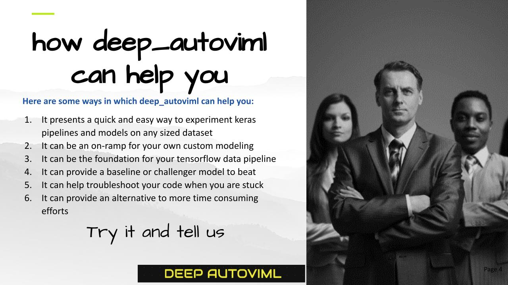

# deep_autoviml
## Build keras pipelines and models in a single line of code!

[](https://www.python.org/)
[](https://github.com/AutoViML)
[](https://github.com/RichardLitt/standard-readme)
[](https://pypi.org/project/autoviml)
[](https://github.com/AutoViML)
## Table of Contents
<ul>
<li><a href="#background">Background</a></li>
<li><a href="#features">Features</a></li>
<li><a href="#technology">Technology</a></li>
<li><a href="#install">Install</a></li>
<li><a href="#usage">Usage</a></li>
<li><a href="#api">API</a></li>
<li><a href="#tips">Tips for using deep_autoviml</a></li>
<li><a href="#maintainers">Maintainers</a></li>
<li><a href="#contributing">Contributing</a></li>
<li><a href="#license">License</a></li>
</ul>

## Background
deep_autoviml is a tensorflow >2.4-enabled, keras-ready, model and pipeline building utility.
deep autoviml is meant for:
- data engineers, data scientists and ml engineers to quickly prototype TF 2.4.1+ models and pipelines for any data set, any size
- they can discard the model yet keep the pipeline for further fine-tuning and model building of their own
- ✨Open Source  ✨


## Features

- Import a CSV file(s) and watch deep_autoviml quickly convert it into a keras preprocessing pipeline and a functional model in one line of code
- Uses the powerful but fast, [STORM tuner](https://github.com/ben-arnao/StoRM) to quickly search for best hyperparameters of the keras model
- if you want to fine tune the model, you can increase change the model_options or keras_options dictionaries to provide your own custom tuning
- You can import your own custom Sequential model and watch it transform it into a functional model with additional preprocessing and output layers and train the model with your data 
- You can save the model on your local machine or copy it to a GCS (or any cloud provider's) storage and serve it from there using TF Serving 
- Since your model contains the preprocessing layers built-in, you just need to provide Tf serving with raw data to test and you will get back predictions in return
- Export documents as Markdown, HTML and PDF


deep_autoviml is a powerful library with a very simple interface:

> The overriding design goal for deep_autoviml 
> syntax was to make it as easy
> as possible to use. The idea that 
> building a tensorflow model and pipeline
> should be complex and take extensive time,
> is no longer correct with deep_autoviml.



## Technology

deep_autoviml uses a number of open source projects to work properly:

- [tensorflow](https://www.tensorflow.org/) - we use TF 2.4.1 and later versions only
- [tf.keras](https://www.tensorflow.org/api_docs/python/tf/keras) - we use the awesome tf.keras library with its latest features to add preprocessing layers to the model directly
- [storm-tuner](https://github.com/ben-arnao/StoRM) - storm-tuner is an amazing new library that enables us to quickly fine tune our keras sequential models with hyperparameters and find a performant model within a few trials.

## Install

deep_autoviml requires [tensorflow](https://www.tensorflow.org/api_docs/python/tf) v2.4.1+ and [storm-tuner](https://github.com/ben-arnao/StoRM)  to run. Don't worry! We will install these libraries when you install deep_autoviml.

```sh
pip install deep_autoviml
```

For your own conda environment...

```
conda create -n <your_env_name> python=3.7 anaconda
conda activate <your_env_name> # ON WINDOWS: `source activate <your_env_name>`
pip install deep_autoviml
or
pip install git+https://github.com/AutoViML/deep_autoviml.git
```

## Usage

deep_autoviml requires only a single line of code to get started. You can however, fine tune the model we build using multiple options as dictionaries named "model_options" and "keras_options". These two dictionaries enable you to fine tune hyperparameters for building the tf.keras model.
Instructions on how to use them are linked below.

```
from deep_autoviml import deep_autoviml as deep
```

Load a data set (any .csv or .gzip or .gz or .txt file) into deep_autoviml and it will split it into Train and Validation  datasets inside. You only need to provide a target variable, a project_name to store files in your local machine and leave the rest to defaults:

```
output = deepauto.run(train, target, keras_model_type="auto",project_name="deep_autoviml", keras_options={}, model_options={}, save_model_flag=True, use_my_model='', verbose=0)
```

Finally, deep_autoviml writes your saved model file to disk in the current directory under project_name folder.

## API
**Arguments**

- `train`: could be a datapath+filename or a pandas dataframe. Deep Auto_ViML even handles gz or gzip files. You must specify the full path and file name for it find and load it.
- `target`: name of the target variable in the data set.
- `keras_model_type`: could be "auto" or any of the built-in model types such as "deep","big deep","giant deep",'cnn1','cnn2', etc. It is best to leave it at default "auto" mode.
- `project_name`: must be a string. Name of the folder where we will save your keras saved model and logs for tensorboard
- `model_options`: must be a dictionary. For example: {'max_trials':5} sets the number of trials to run Storm-Tuner to search for the best hyper parameters for your keras model.
- `keras_options`: must be a dictionary. You can use it for changing any keras model option you want such as "epochs", "kernel_initializer", "activation", "loss", "metrics", etc.
- `save_model_flag`: must be True or False. The model will be saved in keras model format.
- `use_my_model`: bring your own mode that you have defined previously. This model must be a keras Sequential model with NO input layers or output layers! We will add those layers. Just specify your hidden layers (Dense, Conv1D, Conv2D, etc.), dropouts, activations, etc. If you don't want to use this option, just leave it as "empty string".
- `verbose`: must be 0, 1 or 2. Can also be True or False.

## Tips
You can use the following tricks to make deep_autoviml work best for you:
- `model_options = {"model_use_case":'pipeline'}`: If you only want keras preprocessing layers (i.e. data Pipeline) then set the model_use_case to pipeline and Deep Auto_ViML will not build a model but just return keras input and preprocessing layers. You can add these inputs and output layers to any sequential model you want and build your own custom model.
- `model_options = {max_trials:5}`: Always start with a small number of max_trials in model_options dictionary or a dataframe. Start with 5 trials and increase it by 20 each time to see if performance improves. Stop when performance of the model doesn't improve any more. This takes time.
- `model_options = {'cat_feat_cross_flag':True}`: default is False but change it to True and see if adding feature crosses with your categorical features helps improve the model. However, this will explode the number of features in your model. Be careful.
- `model_options = {'nlp_char_limit':20}`: If you want to run NLP Text preprocessing on any column, set this character limit low and deep_autoviml will then detect that column as an NLP column automatically. The default is 30 chars.
- `keras_options = {"patience":30}`: If you want to reduce Early Stopping, then increase the patience to 30 or higher. Your model will train longer but you might get better performance.
- `use_my_model = sequential_model`: If you want to bring your own custom model for training, then define a Keras Sequential model but don't include inputs or output layers. Just define your hidden layers. Deep Auto_ViML will automatically add inputs and outputs and train your model. It will also save the model after training. You can use this model for predictions.


## Maintainers

* [@AutoViML](https://github.com/AutoViML)

## Contributing

See [the contributing file](CONTRIBUTING.md)!

PRs accepted.

## License

Apache License 2.0 © 2020 Ram Seshadri

## DISCLAIMER
This project is not an official Google project. It is not supported by Google and Google specifically disclaims all warranties as to its quality, merchantability, or fitness for a particular purpose.